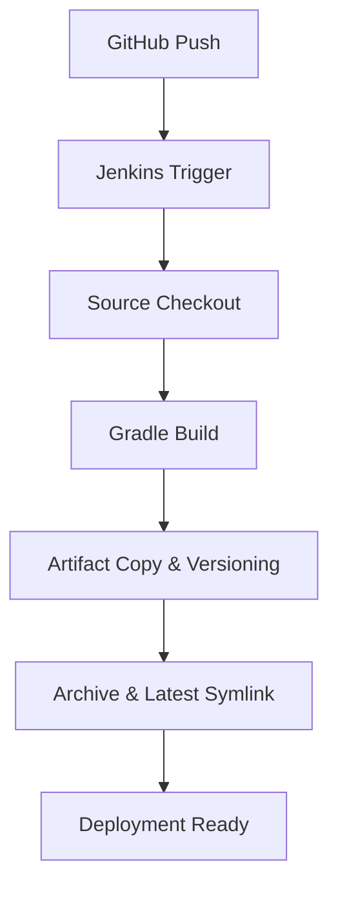

# Spring Boot CI/CD with Jenkins & Docker 🚀

**Jenkins를 활용한 Spring Boot 애플리케이션 자동화 빌드 파이프라인 구축**


이 프로젝트는 **Spring Boot 애플리케이션을 Jenkins와 Docker 기반으로 자동 빌드/배포**하는 과정을 다룹니다. 즉, 개발자가 GitHub에 코드를 푸시하면 → Jenkins가 코드를 가져와 빌드하고 → 빌드된 JAR을 관리하고 → 나아가 배포까지 자동화할 수 있도록 구성했습니다.

---

## 🎯 프로젝트 목표

1. **Docker 기반 Jenkins 환경 구축**
    - 컨테이너로 Jenkins를 실행해, 설치·환경 의존성을 최소화하고 재현 가능한 CI 환경을 만듭니다.
2. **Spring Boot 애플리케이션 자동 빌드**
    - GitHub 코드 변경 시 Jenkins가 Gradle 빌드를 자동 실행해, 수동 작업과 빌드 오류를 줄입니다.
3. **빌드 아티팩트 호스트 동기화**
    - 컨테이너 내부 결과물이 아닌, 호스트 디렉토리에 JAR 파일을 저장해 접근성과 관리성을 높입니다.
4. **버전 관리 및 배포 자동화**
    - 타임스탬프 기반 JAR 파일 관리와 `latest` 심볼릭 링크를 통해, 롤백과 배포를 손쉽게 지원합니다.

---

## 📋 기술 스택

| 구분 | 기술 | 특징 |
| --- | --- | --- |
| **CI/CD** | Jenkins (Docker) | 업계 표준 CI 도구, 플러그인 생태계 풍부, Docker 기반으로 빠르게 설치/실습 가능 |
| **애플리케이션** | Spring Boot 3.x | 금융권·대규모 서비스에서 흔히 쓰이는 프레임워크, 배포 단위(JAR) 관리 용이 |
| **빌드 도구** | Gradle | 멀티모듈/대형 프로젝트에서 Maven보다 빠른 빌드 속도와 설정 유연성 제공 |
| **컨테이너** | Docker | 빌드 환경 표준화, Jenkins 자체도 컨테이너로 실행 가능 |
| **JDK** | OpenJDK 17 | LTS 버전, Spring Boot 3.x와 호환성 확보 |

---

## 🚀 Quick Start

### 1. Jenkins 컨테이너 실행

```bash
# Jenkins 컨테이너 시작 (JDK 17 포함)
docker run --name myjenkins2 -p 8888:8080 \
  -v $(pwd)/appjardir:/var/jenkins_home/appjar \
  jenkins/jenkins:lts-jdk17
```

- `-p 8888:8080`: 로컬 8888 포트를 Jenkins 웹 UI(8080)와 매핑.
- `-v $(pwd)/appjardir:/var/jenkins_home/appjar`: Jenkins 컨테이너가 만든 빌드 결과물을 호스트에서 바로 확인 가능.
- `jenkins/jenkins:lts-jdk17`: 안정적인 LTS 버전 Jenkins + Java 17 포함 이미지

---

### 2. 초기 설정

```bash
# Jenkins 초기 비밀번호 확인
docker logs myjenkins2

# 브라우저에서 Jenkins 접속
open http://localhost:8888
```

---

### 3. 파이프라인 생성

1. Jenkins 대시보드 → **New Item → Pipeline** 선택
2. 파이프라인 스크립트 입력
3. **Save → Build Now**

👉 Jenkinsfile로 관리해 **버전 추적 + 이식성 확보**

---

## 🏗️ Pipeline Configuration

<details>
<summary><strong>📄 Jenkins Pipeline Script (펼치기)</strong></summary>

```groovy
pipeline {
  agent any
  options {
    timestamps()
  }
  environment {
    DEST_DIR = '/var/jenkins_home/appjar'
    TZ       = 'Asia/Seoul'
    JAVA_HOME = '/usr/lib/jvm/java-17-openjdk-amd64'
    PATH = "${JAVA_HOME}/bin:${PATH}"
  }
  stages {
    stage('Checkout') {
      steps {
        echo 'Git 저장소에서 코드 가져오기'
        git branch: 'main', url: '<https://github.com/yunkihong-dev/CI-CD-Study.git>'
      }
    }
    stage('Build with Gradle') {
      steps {
        echo 'Gradle 빌드 시작'
        dir('step04_gradleBuild') {
          sh '''#!/bin/bash
            set -euo pipefail
            chmod +x ./gradlew
            ./gradlew clean build -x test
          '''
        }
      }
    }
    stage('Copy Jar to Build Directory') {
      steps {
        echo '빌드된 JAR을 날짜별 파일명으로 DEST_DIR에 저장'
        sh '''#!/bin/bash
          set -euo pipefail

          ts="$(date +%Y%m%d_%H%M%S)"

          echo "📁 Creating directory: ${DEST_DIR}"
          mkdir -p "${DEST_DIR}"

          jar="$(ls -1 step04_gradleBuild/build/libs/*.jar \\
                 | grep -vE '(-plain|sources|javadoc)\\\\.jar$' \\
                 | head -n 1 || true)"

          if [ -z "${jar}" ]; then
            echo "❌ JAR 파일을 찾을 수 없습니다."
            exit 1
          fi

          echo "📦 Found JAR: ${jar}"

          cp "${jar}" "${DEST_DIR}/app_${ts}.jar"
          chmod 644 "${DEST_DIR}/app_${ts}.jar"

          ln -sfn "app_${ts}.jar" "${DEST_DIR}/app_latest.jar"

          echo "✅ Copied: ${DEST_DIR}/app_${ts}.jar"
          echo "🔗 Updated link: ${DEST_DIR}/app_latest.jar"

          echo "📋 Build artifacts:"
          ls -la "${DEST_DIR}/"
        '''
      }
    }
    stage('Archive Artifacts') {
      steps {
        archiveArtifacts artifacts: 'step04_gradleBuild/build/libs/*.jar',
                         fingerprint: true,
                         onlyIfSuccessful: true
      }
    }
  }
  post {
    success {
      echo '✅ Build & copy complete.'
      echo "📂 JAR files are available in: ${env.DEST_DIR}"
    }
    failure { echo '❌ Build failed — 로그를 확인하세요.' }
  }
}

```

</details>

- `Checkout`: GitHub 메인 브랜치에서 최신 코드 가져오기
- `Build`: Gradle로 빌드 (테스트 제외해 속도 확보)
- `Copy Jar`: 타임스탬프 기반 버전 관리 + latest 링크 제공
- `Archive Artifacts`: Jenkins가 빌드 결과물을 관리하도록 아카이빙

---

## 📁 프로젝트 구조

<details> <summary>📂 디렉토리 트리 (펼치기)</summary>

```
├─step04_gradleBuild
│  ├─.gradle
│  │  ├─8.14.3
│  │  │  ├─checksums
│  │  │  ├─executionHistory
│  │  │  ├─expanded
│  │  │  ├─fileChanges
│  │  │  ├─fileHashes
│  │  │  └─vcsMetadata
│  │  ├─buildOutputCleanup
│  │  └─vcs-1
│  ├─.settings
│  ├─bin
│  │  ├─main
│  │  │  ├─com
│  │  │  │  └─fisa
│  │  │  │      └─app
│  │  │  │          └─controller
│  │  │  └─templates
│  │  └─test
│  │      └─com
│  │          └─fisa
│  │              └─app
│  ├─gradle
│  │  └─wrapper
│  └─src
│      ├─main
│      │  ├─java
│      │  │  └─com
│      │  │      └─fisa
│      │  │          └─app
│      │  │              └─controller
│      │  └─resources
│      │      ├─static
│      │      └─templates
│      └─test
│          └─java
│              └─com
│                  └─fisa
│                      └─app
└─step10-CICD
    ├─.mvn
    │  └─wrapper
    ├─.settings
    ├─src
    │  ├─main
    │  │  ├─java
    │  │  │  └─com
    │  │  │      └─example
    │  │  │          └─demo
    │  │  └─resources
    │  │      ├─static
    │  │      └─templates
    │  └─test
    │      └─java
    │          └─com
    │              └─example
    │                  └─demo
    └─target
        └─...

```

</details>

---

## 🔄 파이프라인 플로우



---

## 🎛️ 주요 Features

### ✨ 자동화 빌드

- GitHub 연동으로 코드 변경 시 자동 빌드
- Gradle 기반 빌드 파이프라인 구성
- 테스트 스킵 옵션으로 빠른 빌드 지원

### 🗂️ 아티팩트 관리

- 타임스탬프 기반 JAR 버전 관리 → `app_20231216_120614.jar`
- 최신 버전 접근을 위한 `app_latest.jar` 심볼릭 링크 제공
- **Bind Mount**(`v`)를 통해 컨테이너 내부 디렉토리(`/var/jenkins_home/appjar`)와 호스트 디렉토리(`./appjardir`)를 직접 연결해 결과물 동기화

> 📌 왜 Bind Mount를 쓸까?
> 
- Jenkins 컨테이너가 만든 빌드 결과물을 호스트에서 바로 확인 가능
- 특정 디렉토리(예: `./appjardir`)를 지정해, **결과물을 원하는 위치에 관리**할 수 있음
- 볼륨(`docker volume`)보다 직관적이고 로컬 실습·학습 환경에 적합

### 🔍 모니터링 & 로깅

- Jenkins 콘솔 로그로 빌드 상태 실시간 확인
- 아티팩트 핑거프린트로 변경 이력 추적
- 성공/실패 여부에 따라 자동 후처리 실행

---

## 🧪 테스트 방법

### 빌드 결과 확인

```bash
# 호스트에서 빌드 결과 확인
ls -la appjardir/

# 출력 예시:
# -rw-r--r-- 1 1000 1000 25MB Dec 16 12:06 app_20231216_120614.jar
# lrwxrwxrwx 1 1000 1000   23 Dec 16 12:06 app_latest.jar -> app_20231216_120614.jar
```

### JAR 파일 실행 테스트

```bash
# 최신 빌드 실행
cd appjardir
java -jar app_latest.jar

# 또는 특정 버전 실행
java -jar app_20231216_120614.jar

```

## 🚢 배포 확장

<details>
<summary><strong>🐳 Docker 배포 스테이지 추가</strong></summary>

```groovy
stage('Deploy to Docker') {
  steps {
    sh '''
      # 기존 컨테이너 정리
      docker stop spring-app || true
      docker rm spring-app || true

      # 새 컨테이너 실행
      docker run -d \\
        --name spring-app \\
        -p 8080:8080 \\
        -v $(pwd)/appjardir:/app \\
        eclipse-temurin:17-jre \\
        java -jar /app/app_latest.jar

      echo "🚀 Application deployed at <http://localhost:8080>"
    '''
  }
}

```

</details>

---

## 🛠️ 트러블슈팅

| 문제 상황 | 원인 | 해결 방법 |
| --- | --- | --- |
| **권한 오류 (`/opt/builds` 접근 불가)** | Jenkins 컨테이너 내부의 기본 사용자(UID 1000)가 호스트 디렉토리에 접근 권한이 없음 | Jenkins 홈 디렉토리(`/var/jenkins_home/appjar`)를 볼륨으로 마운트하거나, 호스트 디렉토리 소유자를 UID 1000으로 맞춰줌 |
| **Java 버전 문제** | Jenkins 컨테이너에 설치된 JDK 버전과 프로젝트의 요구 버전(Spring Boot 3.x → JDK 17 이상)이 불일치 | 환경 변수 `JAVA_HOME`을 `/usr/lib/jvm/java-17-openjdk-amd64`로 지정하고, PATH에도 반영해 빌드 시 올바른 JDK를 사용하도록 설정 |
| **Gradle 실행 권한 오류 (`gradlew: Permission denied`)** | 프로젝트에 포함된 `gradlew` 파일이 실행 권한을 갖고 있지 않음 | Jenkins 빌드 스텝에서 `chmod +x ./gradlew` 명령어를 추가하여 실행 권한을 부여 |
| **Bind Mount 경로 접근 실패** | 컨테이너와 호스트 간 UID/GID 불일치 또는 호스트 디렉토리 권한 제한 | 호스트 디렉토리 권한을 UID 1000 (Jenkins 기본 계정)으로 변경하거나 `chmod 755` 이상으로 퍼미션을 수정 |

---

## 📊 성과

- **⏱️ 빌드 시간 (2~3분)**
    - Jenkins가 GitHub에서 코드 체크아웃 → Gradle 빌드 → JAR 생성까지 약 2~3분 소요.
    - 기존 로컬 빌드 대비 큰 차이는 없지만, **자동화로 개발자 개입 시간이 0분**이 된 것이 핵심 성과.
- **🤖 자동화율 (100%)**
    - 코드 푸시 후 Jenkins가 모든 과정을 자동으로 처리.
    - 개발자가 해야 할 일은 단순히 **“코드 커밋 & 푸시”** 뿐이며, 나머지는 파이프라인에서 처리됨.
    - 이를 통해 **반복 작업 제거 + 휴먼 에러 최소화** 효과를 얻음.
- **📦 아티팩트 관리 (버전 + 최신 링크)**
    - 빌드 산출물은 `app_YYYYMMDD_HHMMSS.jar` 형태로 저장되어 **버전 추적 가능**.
    - 동시에 `app_latest.jar` 심볼릭 링크를 제공하여 **즉시 배포**에도 활용 가능.
    - 이로써 **롤백 안정성 + 최신 배포 편의성**을 모두 확보.
- **🌍 가용성 & 이식성**
    - Jenkins 자체와 빌드 환경을 **Docker 컨테이너**로 운영하기 때문에, OS나 환경에 구애받지 않음.
    - 동일한 설정을 다른 서버/클라우드에 그대로 재현 가능하여, **CI/CD 환경 이식성 보장**.
    - 이는 추후 Kubernetes 기반 확장에도 바로 연결될 수 있음.

---
