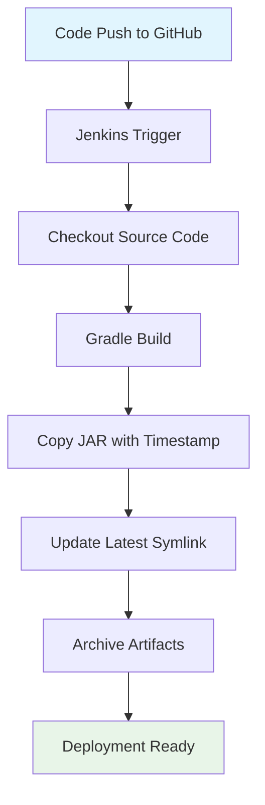

# Spring Boot CI/CD with Jenkins & Docker 🚀

Jenkins를 활용한 Spring Boot 애플리케이션 자동화 빌드 파이프라인 구축


## 🎯 프로젝트 목표

- Docker 기반 Jenkins 환경 구축
- Spring Boot 애플리케이션 자동 빌드
- 빌드 아티팩트의 호스트 시스템 동기화
- 버전 관리 및 배포 자동화

## 📋 기술 스택

| 구분 | 기술 |
|------|------|
| **CI/CD** | Jenkins (Docker) |
| **애플리케이션** | Spring Boot 3.x |
| **빌드 도구** | Gradle |
| **컨테이너** | Docker |
| **JDK** | OpenJDK 17 |

## 🚀 Quick Start

### 1. Jenkins 컨테이너 실행

```bash
# Jenkins 컨테이너 시작 (JDK 17 포함)
docker run --name myjenkins2 -p 8888:8080 \
  -v $(pwd)/appjardir:/var/jenkins_home/appjar \
  jenkins/jenkins:lts-jdk17
```

### 2. 초기 설정

```bash
# Jenkins 초기 비밀번호 확인
docker logs myjenkins2

# 브라우저에서 Jenkins 접속
open http://localhost:8888
```

### 3. 파이프라인 생성

1. **New Item** → **Pipeline** 선택
2. 아래 파이프라인 스크립트 복사/붙여넣기
3. **Save** → **Build Now**

## 🏗️ Pipeline Configuration

<details>
<summary><strong>📄 Jenkins Pipeline Script</strong></summary>

```groovy
pipeline {
  agent any
  options {
    timestamps()
  }
  environment {
    DEST_DIR = '/var/jenkins_home/appjar'
    TZ       = 'Asia/Seoul'
    JAVA_HOME = '/usr/lib/jvm/java-17-openjdk-amd64'
    PATH = "${JAVA_HOME}/bin:${PATH}"
  }
  stages {
    stage('Checkout') {
      steps {
        echo 'Git 저장소에서 코드 가져오기'
        git branch: 'main', url: 'https://github.com/yunkihong-dev/CI-CD-Study.git'
      }
    }
    stage('Build with Gradle') {
      steps {
        echo 'Gradle 빌드 시작'
        dir('step04_gradleBuild') {
          sh '''#!/bin/bash
            set -euo pipefail
            chmod +x ./gradlew
            ./gradlew clean build -x test
          '''
        }
      }
    }
    stage('Copy Jar to Build Directory') {
      steps {
        echo '빌드된 JAR을 날짜별 파일명으로 DEST_DIR에 저장'
        sh '''#!/bin/bash
          set -euo pipefail
          
          ts="$(date +%Y%m%d_%H%M%S)"
          
          echo "📁 Creating directory: ${DEST_DIR}"
          mkdir -p "${DEST_DIR}"
          
          jar="$(ls -1 step04_gradleBuild/build/libs/*.jar \
                 | grep -vE '(-plain|sources|javadoc)\\.jar$' \
                 | head -n 1 || true)"
          
          if [ -z "${jar}" ]; then
            echo "❌ JAR 파일을 찾을 수 없습니다."
            exit 1
          fi
          
          echo "📦 Found JAR: ${jar}"
          
          cp "${jar}" "${DEST_DIR}/app_${ts}.jar"
          chmod 644 "${DEST_DIR}/app_${ts}.jar"
          
          ln -sfn "app_${ts}.jar" "${DEST_DIR}/app_latest.jar"
          
          echo "✅ Copied: ${DEST_DIR}/app_${ts}.jar"
          echo "🔗 Updated link: ${DEST_DIR}/app_latest.jar"
          
          echo "📋 Build artifacts:"
          ls -la "${DEST_DIR}/"
        '''
      }
    }
    stage('Archive Artifacts') {
      steps {
        archiveArtifacts artifacts: 'step04_gradleBuild/build/libs/*.jar',
                         fingerprint: true,
                         onlyIfSuccessful: true
      }
    }
  }
  post {
    success { 
      echo '✅ Build & copy complete.'
      echo "📂 JAR files are available in: ${env.DEST_DIR}"
    }
    failure { echo '❌ Build failed — 로그를 확인하세요.' }
  }
}
```

</details>

## 📁 프로젝트 구조

```
├─step04_gradleBuild
│  ├─.gradle
│  │  ├─8.14.3
│  │  │  ├─checksums
│  │  │  ├─executionHistory
│  │  │  ├─expanded
│  │  │  ├─fileChanges
│  │  │  ├─fileHashes
│  │  │  └─vcsMetadata
│  │  ├─buildOutputCleanup
│  │  └─vcs-1
│  ├─.settings
│  ├─bin
│  │  ├─main
│  │  │  ├─com
│  │  │  │  └─fisa
│  │  │  │      └─app
│  │  │  │          └─controller
│  │  │  └─templates
│  │  └─test
│  │      └─com
│  │          └─fisa
│  │              └─app
│  ├─gradle
│  │  └─wrapper
│  └─src
│      ├─main
│      │  ├─java
│      │  │  └─com
│      │  │      └─fisa
│      │  │          └─app
│      │  │              └─controller
│      │  └─resources
│      │      ├─static
│      │      └─templates
│      └─test
│          └─java
│              └─com
│                  └─fisa
│                      └─app
└─step10-CICD
    ├─.mvn
    │  └─wrapper
    ├─.settings
    ├─src
    │  ├─main
    │  │  ├─java
    │  │  │  └─com
    │  │  │      └─example
    │  │  │          └─demo
    │  │  └─resources
    │  │      ├─static
    │  │      └─templates
    │  └─test
    │      └─java
    │          └─com
    │              └─example
    │                  └─demo
    └─target
        └─...
```

## 🔄 파이프라인 플로우



## 🎛️ 주요 Features

### ✨ 자동화된 빌드 프로세스
- GitHub 연동으로 소스코드 자동 체크아웃
- Gradle 빌드 시스템으로 애플리케이션 빌드
- 테스트 스킵 옵션으로 빠른 빌드

### 🗂️ 스마트한 아티팩트 관리
- 타임스탬프 기반 버전 관리: `app_20231216_120614.jar`
- 최신 버전 심링크 자동 업데이트: `app_latest.jar`
- Docker 볼륨 마운트로 호스트 동기화

### 🔍 모니터링 & 로깅
- 빌드 과정 실시간 콘솔 출력
- 아티팩트 핑거프린트로 변경사항 추적
- 성공/실패 상태별 후처리 액션

## 🧪 테스트 방법

### 빌드 결과 확인
```bash
# 호스트에서 빌드 결과 확인
ls -la appjardir/

# 출력 예시:
# -rw-r--r-- 1 1000 1000 25MB Dec 16 12:06 app_20231216_120614.jar
# lrwxrwxrwx 1 1000 1000   23 Dec 16 12:06 app_latest.jar -> app_20231216_120614.jar
```

### JAR 파일 실행 테스트
```bash
# 최신 빌드 실행
cd appjardir
java -jar app_latest.jar

# 또는 특정 버전 실행
java -jar app_20231216_120614.jar
```

## 🚢 배포 확장

<details>
<summary><strong>🐳 Docker 배포 스테이지 추가</strong></summary>

```groovy
stage('Deploy to Docker') {
  steps {
    sh '''
      # 기존 컨테이너 정리
      docker stop spring-app || true
      docker rm spring-app || true
      
      # 새 컨테이너 실행
      docker run -d \
        --name spring-app \
        -p 8080:8080 \
        -v $(pwd)/appjardir:/app \
        eclipse-temurin:17-jre \
        java -jar /app/app_latest.jar
      
      echo "🚀 Application deployed at http://localhost:8080"
    '''
  }
}
```

</details>

## 🛠️ 트러블슈팅

| 문제 | 해결방법 |
|------|----------|
| 권한 오류 (`/opt/builds`) | 볼륨 마운트 경로 사용 (`/var/jenkins_home/appjar`) |
| Java 버전 문제 | `JAVA_HOME` 환경변수 확인 |
| Gradle 실행 권한 | `chmod +x ./gradlew` 추가 |
| 볼륨 마운트 실패 | 호스트 디렉토리 권한 확인 (UID 1000) |

## 📊 성과 지표

- **빌드 시간**: ~2-3분 (프로젝트 크기에 따라)
- **자동화율**: 100% (코드 푸시부터 배포 준비까지)
- **아티팩트 관리**: 타임스탬프 기반 버전 관리
- **가용성**: Docker 기반 이식성 보장


## 📝 License

This project is licensed under the MIT License - see the [LICENSE](LICENSE) file for details.

---

<div align="center">

**Built with ❤️ by [YourName]**

[⭐ Star this repo](https://github.com/yourusername/spring-boot-cicd) | [🐛 Report Bug](https://github.com/yourusername/spring-boot-cicd/issues) | [💡 Request Feature](https://github.com/yourusername/spring-boot-cicd/issues)

</div>
